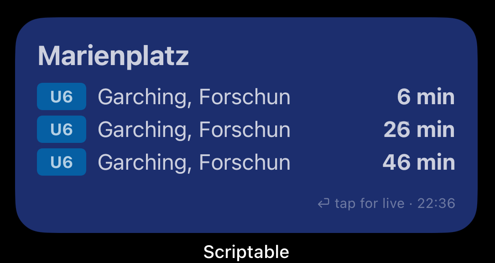
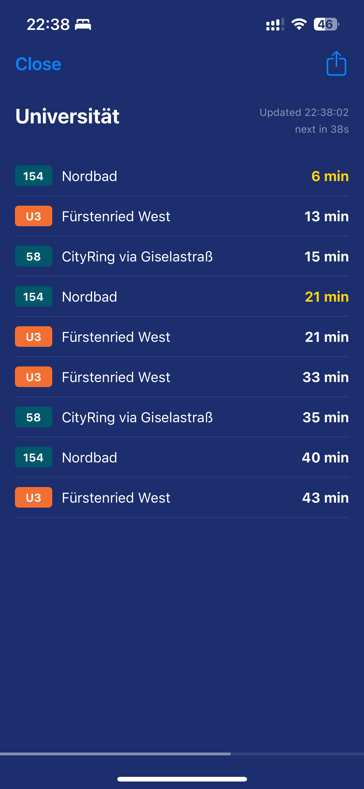
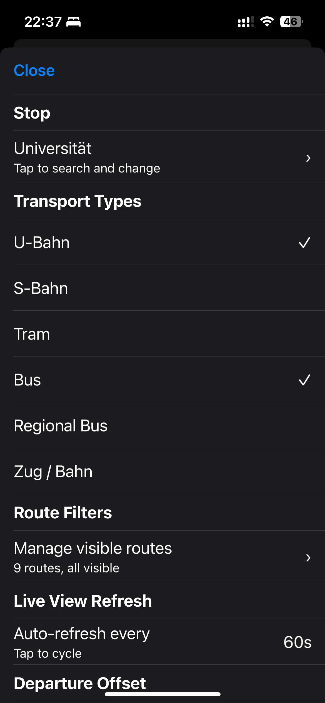

# MVG Departure Monitor — Scriptable Widget

A real-time Munich public transport departure monitor for iOS, built with [Scriptable](https://scriptable.app).  
Shows live departures from any MVG stop directly on your home screen, with a full-screen live board when tapped.

---

## Disclaimer

This project is not an official project from the Münchner Verkehrsgesellschaft (MVG). It was developed as a private project from lack of a documented and openly accessible API. It simply reproduces the requests made by https://www.mvg.de to provide a barrier-free access to local timetable information.

Therefore, the following usage restrictions from the MVG Imprint do apply to all users of this package:

> Our systems are used for direct customer interaction. The processing of our content or data by third parties requires our express consent. For private, non-commercial purposes, moderate use is tolerated without our explicit consent. Any form of data mining does not constitute moderate use. We reserve the right to revoke this permission in principle or in individual cases. Please direct any questions to: redaktion@mvg.de

(from https://www.mvg.de/impressum.html, accessed on 23 April 2026)

## Screenshots

### Widget (Home Screen)

### Live Board (Full Screen)

### Settings

## Files

| File | Role |
|---|---|
| `mvg-widget.js` | The main widget. Displays departures on the home screen. Tap → opens full-screen live board. |
| `mvg-settings.js` | Settings configurator. Run once from the Scriptable app to configure everything. |

Both scripts share a single settings file stored at:
`Scriptable/mvg_widget_settings.json` (in the iOS Files app → On My iPhone → Scriptable)

---

## Installation

1. Install [Scriptable](https://apps.apple.com/de/app/scriptable/id1405459188) from the App Store
2. Copy the contents of `mvg-widget.js` into a new Scriptable script named **MVG Widget**
3. Copy the contents of `mvg-settings.js` into a new Scriptable script named **MVG Settings**
4. Run **MVG Settings** from the Scriptable app to configure your stop and preferences
5. Add a Scriptable widget to your home screen, select **MVG Widget** as the script

---

## Configuration (mvg-settings.js)

Run this script from inside the Scriptable app. It opens an interactive settings screen with the following sections:

### Stop
Search for any MVG stop by name (partial names work: "Ost", "Haupt", "Giesing").  
Results show the stop name, district, and which transport types serve it (`U · S · T · B`).  
Selecting a stop saves its name and internal MVG ID — no re-lookup needed on every widget refresh.

> Changing the stop automatically clears your route filter list so stale routes from the old stop don't appear.

### Transport Types
Toggle which vehicle types to show:
- U-Bahn
- S-Bahn
- Tram
- Bus
- Regional Bus
- Zug / Bahn

Disabled types are excluded from both the widget and the live board.

### Route Filters
Fine-grained control over individual routes and directions.

**Why this exists:** At a stop like Olympia-Einkaufzentrum, you might only care about U1 towards Mangfallplatz in the morning and want to hide U1 towards Olympia-Einkaufzentrum and U3 towards Moosach entirely.

**How to use:**
1. Tap **Manage visible routes**
2. The script fetches current departures and builds a list of all known routes at your stop
3. Routes are grouped by type (U-Bahn, S-Bahn, Tram, Bus…) and show as `U1  →  Mangfallplatz`
4. Tap any route to toggle it hidden (no checkmark = hidden)
5. **Show all routes** at the bottom resets all filters
6. Re-open this screen any time to discover new routes that weren't departing during a previous visit

The known route list is persistent — once a route has been seen it stays in the list even if it's not currently running.

### Live View Refresh
Controls how often the full-screen live board auto-refreshes while open.  
Tap to cycle through: **30s → 60s → 90s**

### Departure Offset
Hides departures leaving within the next N minutes — useful if your stop is a 5-minute walk away.  
Tap to cycle through: **off → 2 min → 5 min → 10 min → 15 min**

---

## Widget (mvg-widget.js)

### Home Screen
- Displays the next departures for your configured stop
- Each row shows: colored line badge, destination, and minutes until departure
- Delayed departures shown in **yellow**
- Footer shows last update time and a hint to tap for live view
- Widget refreshes approximately every 15 minutes (iOS decides actual frequency)

### Widget Size Support
| Size | Departures shown |
|---|---|
| Small | 4 |
| Medium | 3 |
| Large | 8 |

### Live Board (tap the widget)
Opens a full-screen departure board inside Scriptable:
- All departures with real MVG line colors
- `jetzt` in **green** for departures leaving now
- Delayed departures in **yellow**
- Animated progress bar at the bottom counting down to the next refresh
- Live countdown showing "next in Xs"
- Auto-refreshes in the background on your configured interval (30 / 60 / 90 seconds)
- Timer stops automatically when you close the view

### Widget Parameter (optional)
You can override the stop per widget instance using the widget's **Parameter** field (long-press widget → Edit Widget → Parameter). Useful if you want multiple widgets for different stops without changing settings.

---

## Data Source

All data is fetched from the official MVG API:
- Stop lookup: `https://www.mvg.de/api/bgw-pt/v3/locations`
- Departures: `https://www.mvg.de/api/bgw-pt/v3/departures`

No API key required. Data is real-time including delays.

---

## Line Colors

| Line | Color |
|---|---|
| U1 | Green |
| U2 | Red |
| U3 | Orange |
| U4 | Teal |
| U5 | Brown |
| U6 | Blue |
| S1 | Light Blue |
| S2 | Light Green |
| S3 | Purple |
| S4 | Red |
| S6 | Dark Green |
| S7 | Dark Red |
| S8 | Black |
| S20 | Pink |
| Bus | Dark Teal |
| Tram | Red |

---

## Notes

- **Widget refresh rate:** iOS throttles widget refresh to approximately every 5–15 minutes regardless of script settings. This is a hard platform limitation. Use the live board (tap the widget) for real-time data.
- **Route filter discovery:** The route list is built from live departures. Visit during different times of day to discover routes that only run in the morning or evening.
- **Multiple stops:** Add multiple Scriptable widgets and set different stop names in the Parameter field of each.
